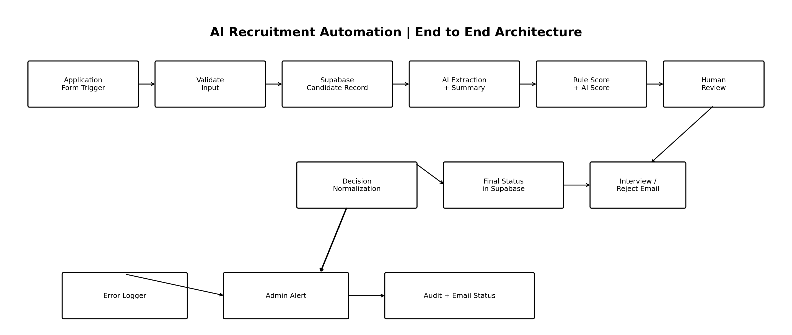

# 📘 Day 1

---

# 🎯 Learning Objectives

By the end of this day I should be able to:
![[Pasted image 20260722155157.png|697]]
    
---

# 📂 Assignments

![[Pasted image 20260722161210.png]]

![[Automation-Opportunities..pdf]]

---

# 💻 Checklist

- [ ]All Accounts created according to the appendix B in the document
		![[Pasted image 20260722160326.png]]
	
- [ ]

---

# 📚 Resources

| Title                                              | Status                              |
| -------------------------------------------------- | ----------------------------------- |
| n8n – Try it / Cloud sign-up                       | https://n8n.io/                     |
| n8n Academy (official free courses & certificates) | https://docs.n8n.io/courses/        |
| n8n Docs – Learning paths                          | https://docs.n8n.io/learning-paths/ |
|                                                    |                                     |

---

# ❓ Frequently Asked Questions

### Question 1
Identify 5 real manual business processes that could be automated
Answer
- Recruitment, Support, Sales, Marketing, Finance

---

# 📋 Revision Checklist

- Date:  22 Jul 2026 Wed
- Today I learned:  What is Automation, and traditional automation vs AI automation
- Today I built / practiced: Setup accounts for tools and github repo.
- Technologies / nodes used: Github, Obsidian and  n8n
- Problem(s) faced: n8n login issue
- How I solved them: waited for 1mins for otp
- Task status: Completed
- GitHub / workflow link: https://github.com/abdulwasay4585/petalnex-internship.git
- Plan for next day: Day 2 Tasks and ongoing learning
    

---

# 📅 Study Log

| Date       | Activity                                            |
| ---------- | --------------------------------------------------- |
| 2026-07-22 | Onboarding, Automation Fundamentals & Account Setup |
|            |                                                     |


---
---
---


# 📘 Day 2

---

# 🎯 Learning Objectives

By the end of this day I should be able to:


---

# 📂 Assignments


### Schedule Trigger

The Schedule Trigger starts the workflow automatically at the configured weekday and time. It acts as the entry point and eliminates the need to run the workflow manually.

### Set

The Set node creates variables such as the reminder message and subject. It organizes the data so later nodes can reuse it easily.

### Telegram Node

The Telegram node connects to the Telegram Bot API and sends the reminder message directly to the specified chat ID.

---

# 💻 Checklist

- [ ]
	
- [ ]

---

# 📚 Resources

| Title                                      | Status                                               |
| ------------------------------------------ | ---------------------------------------------------- |
| n8n – Build your first workflow (tutorial) | https://docs.n8n.io/try-it-out/                      |
| n8n Docs – Trigger nodes                   | https://docs.n8n.io/integrations/builtin/core-nodes/ |
|                                            |                                                      |

---

# 📋 Revision Checklist

- Date:  23 Jul 2026 Thu
- Today I learned: About nodes, triggers, and telegram api.
- Today I built / practiced: Daily Internship Reminder
- Technologies / nodes used: Github, Obsidian,  n8n, and Telegram.
- Problem(s) faced: -
- How I solved them: -
- Task status: Completed
- GitHub / workflow link: https://github.com/abdulwasay4585/petalnex-internship.git
- Plan for next day:  Tasks and ongoing learning
    

---

# 📅 Study Log

| Date       | Activity                                            |
| ---------- | --------------------------------------------------- |
| 2026-07-22 | Onboarding, Automation Fundamentals & Account Setup |
| 2026-07-23 | Created Daily Remainder.                            |
|            |                                                     |


---
---
---


# 📘 Day 3

---

# 🎯 Learning Objectives

By the end of this day I should be able to:


---

# 📂 Assignments


---

# 💻 Checklist

- [ ]
- [ ]

---

# 📚 Resources

| Title                   | Status                                                                 |
| ----------------------- | ---------------------------------------------------------------------- |
| MDN – Working with JSON | https://developer.mozilla.org/en-US/docs/Learn/JavaScript/Objects/JSON |
| n8n Docs – Expressions  | https://docs.n8n.io/code/expressions/                                  |
|                         |                                                                        |

---

# 📋 Revision Checklist

- Date:  24 Jul 2026 Fri
- Today I learned:  about json.
- Today I built / practiced: Created student/employee records.
- Technologies / nodes used: Github, Obsidian,  n8n, and JSON.
- Problem(s) faced: -
- How I solved them: -
- Task status: Completed
- GitHub / workflow link: https://github.com/abdulwasay4585/petalnex-internship.git
- Plan for next day:  Tasks and ongoing learning
    

---


# 📅 Study Log

| Date       | Activity                                            |
| ---------- | --------------------------------------------------- |
| 2026-07-22 | Onboarding, Automation Fundamentals & Account Setup |
| 2026-07-23 | Created Daily Remainder.                            |
| 2026-07-24 | Created student/employee records.                   |


---
---
---


# 📘 Day 4

---

# 🎯 Learning Objectives

By the end of this day I should be able to:


---

# 📂 Assignments


---

# 💻 Checklist

-  
- 

---

# 📚 Resources

| Title                                           | Status                          |
| ----------------------------------------------- | ------------------------------- |
| n8n Docs – Flow logic (IF, Switch, Merge, Loop) | https://docs.n8n.io/flow-logic/ |
|                                                 |                                 |

---

# 📋 Revision Checklist

- Date:  25 Jul 2026 Sat
- Today I learned: loops, if-else, and flow logic in n8n.
- Today I built / practiced: Created small routing workflow
- Technologies / nodes used: Github, Obsidian,  n8n, and JSON.
- Problem(s) faced: -
- How I solved them: -
- Task status: Completed
- GitHub / workflow link: https://github.com/abdulwasay4585/petalnex-internship.git
- Plan for next day:  Tasks and ongoing learning
    

---

# 📅 Study Log

| Date       | Activity                                            |
| ---------- | --------------------------------------------------- |
| 2026-07-22 | Onboarding, Automation Fundamentals & Account Setup |
| 2026-07-23 | Created Daily Remainder.                            |
| 2026-07-24 | Created student/employee records.                   |
| 2026-07-25 | Created small routing workflow                      |
|            |                                                     |

---
---
---

# 📘 Day 5

---

# 🎯 Learning Objectives

By the end of this day I should be able to:


---

# 📂 Assignments


---

# 💻 Checklist

-  

---

# 📚 Resources

| Title                         | Status                                                                          |
| ----------------------------- | ------------------------------------------------------------------------------- |
| n8n Docs – Google Sheets node | https://docs.n8n.io/integrations/builtin/app-nodes/n8n-nodes-base.googlesheets/ |
| n8n Docs – Gmail node         | https://docs.n8n.io/integrations/builtin/app-nodes/n8n-nodes-base.gmail/        |

---

# 📋 Revision Checklist

- Date:  27 Jul 2026 Mon
- Today I learned: loops, google sheets nodes, email nodes in n8n.
- Today I built / practiced: Created Internship Application Processing Workflow.
- Technologies / nodes used: Github, Obsidian,  n8n, JSON, Sheets.
- Problem(s) faced: -
- How I solved them: -
- Task status: Completed
- GitHub / workflow link: https://github.com/abdulwasay4585/petalnex-internship.git
- Plan for next day:  Tasks and ongoing learning
    

---

# 📅 Study Log

| Date       | Activity                                            |
| ---------- | --------------------------------------------------- |
| 2026-07-22 | Onboarding, Automation Fundamentals & Account Setup |
| 2026-07-23 | Created Daily Remainder.                            |
| 2026-07-24 | Created student/employee records.                   |
| 2026-07-25 | Created small routing workflow                      |
| 2026-07-27 | Internship Application Processing                   |
|            |                                                     |


---
---
---


# 📘 Day 6

---

# 🎯 Learning Objectives

By the end of this day I should be able to:


---

# 📂 Assignments


.md)

---

# 💻 Checklist

-  


---

# 📋 Revision Checklist

- Date:  28 Jul 2026 Mon
- Today I learned: -
- Today I built / practiced: Created Candidate Screening Automation.
- Technologies / nodes used: Github, Obsidian,  n8n, JSON, Sheets.
- Problem(s) faced: -
- How I solved them: -
- Task status: Completed
- GitHub / workflow link: https://github.com/abdulwasay4585/Candidate-Screening-Automation-in-n8n.git
- Plan for next day:  Tasks and ongoing learning
    

---

# 📅 Study Log

| Date       | Activity                                            |
| ---------- | --------------------------------------------------- |
| 2026-07-22 | Onboarding, Automation Fundamentals & Account Setup |
| 2026-07-23 | Created Daily Remainder.                            |
| 2026-07-24 | Created student/employee records.                   |
| 2026-07-25 | Created small routing workflow.                     |
| 2026-07-27 | Created Internship Application Processing.          |
| 2026-07-28 | Created Candidate Screening Automation.             |


---
---
---

# 📘 Day 7

---

# 🎯 Learning Objectives

By the end of this day I should be able to:

---

# 📂 Assignments


---

# 💻 Checklist

-  
---

# 📚 Resources

| Title                            | Status                                                      |
| -------------------------------- | ----------------------------------------------------------- |
| MDN – An overview of HTTP        | https://developer.mozilla.org/en-US/docs/Web/HTTP/Overview  |
| MDN – HTTP response status codes | https://developer.mozilla.org/en-US/docs/Web/HTTP/Status    |
| Postman – Learning Center        | https://learning.postman.com/docs/getting-started/overview/ |
| Public APIs list (for practice)  | https://github.com/public-apis/public-apis                  |

---

# 📋 Revision Checklist

- Date:  29 Jul 2026 Wed
- Today I learned: About http request , status codes, api, and headers. 
- Today I built / practiced: Used Weather API in Postman.
- Technologies / nodes used: Github, Obsidian,  Postman, JSON.
- Problem(s) faced: -
- How I solved them: -
- Task status: Completed
- GitHub / workflow link: https://github.com/abdulwasay4585/petalnex-internship.git
- Plan for next day:  Tasks and ongoing learning
    

---

# 📅 Study Log

| Date       | Activity                                            |
| ---------- | --------------------------------------------------- |
| 2026-07-22 | Onboarding, Automation Fundamentals & Account Setup |
| 2026-07-23 | Created Daily Remainder.                            |
| 2026-07-24 | Created student/employee records.                   |
| 2026-07-25 | Created small routing workflow.                     |
| 2026-07-27 | Created Internship Application Processing.          |
| 2026-07-28 | Created Candidate Screening Automation.             |
| 2026-07-29 | Used Weather API in Postman.                        |
|            |                                                     |


---
---
---


# 📘 Day 8

---

# 🎯 Learning Objectives

By the end of this day I should be able to:


---

# 📂 Assignments

**Authentication Method:** The Open Meteo Weather API does **not require authentication**. It is a public REST API that allows users to access weather forecast data without an API key, OAuth token, or any other authentication mechanism. Therefore, the HTTP Request in n8n was configured without any authentication settings.


---

# 💻 Checklist


---

# 📚 Resources

| Title                                         | Status                                                                          |
| --------------------------------------------- | ------------------------------------------------------------------------------- |
| n8n Docs – HTTP Request node                  | https://docs.n8n.io/integrations/builtin/core-nodes/n8n-nodes-base.httprequest/ |
| MDN – Using the Fetch API (concept reference) | https://developer.mozilla.org/en-US/docs/Web/API/Fetch_API/Using_Fetch          |

---

# 📋 Revision Checklist

- Date:  30 Jul 2026 Thu
- Today I learned: About http node , status codes. 
- Today I built / practiced: Created Weather Notification Automation.
- Technologies / nodes used: Github, Obsidian,  Postman, JSON, n8n.
- Problem(s) faced: -
- How I solved them: -
- Task status: Completed
- GitHub / workflow link: https://github.com/abdulwasay4585/petalnex-internship.git
- Plan for next day:  Tasks and ongoing learning
    

---

# 📅 Study Log

| Date       | Activity                                            |
| ---------- | --------------------------------------------------- |
| 2026-07-22 | Onboarding, Automation Fundamentals & Account Setup |
| 2026-07-23 | Created Daily Remainder.                            |
| 2026-07-24 | Created student/employee records.                   |
| 2026-07-25 | Created small routing workflow.                     |
| 2026-07-27 | Created Internship Application Processing.          |
| 2026-07-28 | Created Candidate Screening Automation.             |
| 2026-07-29 | Used Weather API in Postman.                        |
| 2026-07-30 | Created Weather Notification Automation.            |
|            |                                                     |


---
---
---

# 📘 Day 9

---

# 🎯 Learning Objectives

By the end of this day I should be able to:


---

# 📂 Assignments

```

// Messy dataset
const data = [
  {
    name: "   john doe ",
    email: "John@Email.COM",
    score: 95
  },
  {
    name: "aLiCe smith",
    email: "Alice@MAIL.com",
    score: 87
  },
  {
    name: "   BOB JOHNSON",
    email: "BOB@EMAIL.COM",
    score: 78
  },
  {
    name: "mary   brown",
    email: "Mary@Example.COM",
    score: 69
  },
  {
    name: "DAVID wilson",
    email: "David@Example.com",
    score: 91
  },
  {
    name: "  emma davis ",
    email: "EMMA@MAIL.COM",
    score: 82
  },
  {
    name: "James MILLER",
    email: "James@Mail.com",
    score: 73
  },
  {
    name: "  Olivia Garcia",
    email: "Olivia@EMAIL.com",
    score: 97
  },
  {
    name: "michael martinez ",
    email: "Michael@Example.COM",
    score: 66
  },
  {
    name: "SOPHIA Rodriguez",
    email: "Sophia@Mail.Com",
    score: 84
  },
  {
    name: " william Hernandez ",
    email: "William@EMAIL.COM",
    score: 88
  },
  {
    name: "Charlotte Lopez",
    email: "Charlotte@Mail.COM",
    score: 59
  },
  {
    name: " daniel GONZALEZ",
    email: "Daniel@Example.COM",
    score: 92
  },
  {
    name: "Amelia Perez ",
    email: "Amelia@Mail.COM",
    score: 76
  },
  {
    name: " ETHAN THOMAS",
    email: "ETHAN@EMAIL.COM",
    score: 81
  }
];

// Function to convert to Title Case
function titleCase(str) {
  return str
    .trim()
    .toLowerCase()
    .split(/\s+/)
    .map(word =>
      word.charAt(0).toUpperCase() + word.slice(1)
    )
    .join(" ");
}

// Function to assign grade
function getGrade(score) {
  if (score >= 90) return "A";
  if (score >= 80) return "B";
  if (score >= 70) return "C";
  if (score >= 60) return "D";
  return "F";
}

const result = data

.map(person => ({
    name: titleCase(person.name),
    email: person.email.trim().toLowerCase(),
    score: person.score,
    grade: getGrade(person.score)
}))

.filter(person => person.grade === "A" || person.grade === "B");

return result.map(item => ({
    json: item
}));

```


---

# 💻 Checklist


---

# 📚 Resources

| Title                           | Status                                                                |
| ------------------------------- | --------------------------------------------------------------------- |
| n8n Docs – Code node            | https://docs.n8n.io/code/code-node/                                   |
| MDN – JavaScript first steps    | https://developer.mozilla.org/en-US/docs/Learn/JavaScript/First_steps |
| javascript.info (free tutorial) | https://javascript.info/                                              |

---

# 📋 Revision Checklist

- Date:  31 Jul 2026 Fri
- Today I learned: About JS fundamentals. 
- Today I built / practiced:  Transformed messy data in to clean data with js.
- Technologies / nodes used: Github, Obsidian,  Javscript, n8n.
- Problem(s) faced: -
- How I solved them: -
- Task status: Completed
- GitHub / workflow link: https://github.com/abdulwasay4585/petalnex-internship.git
- Plan for next day:  Tasks and ongoing learning
    

---

# 📅 Study Log

| Date       | Activity                                            |
| ---------- | --------------------------------------------------- |
| 2026-07-22 | Onboarding, Automation Fundamentals & Account Setup |
| 2026-07-23 | Created Daily Remainder.                            |
| 2026-07-24 | Created student/employee records.                   |
| 2026-07-25 | Created small routing workflow.                     |
| 2026-07-27 | Created Internship Application Processing.          |
| 2026-07-28 | Created Candidate Screening Automation.             |
| 2026-07-29 | Used Weather API in Postman.                        |
| 2026-07-30 | Created Weather Notification Automation.            |
| 2026-07-31 | Transformed messy data in to clean data with js.    |


---
---
---


# 📘 Day 10

---

# 🎯 Learning Objectives

By the end of this day I should be able to:


---

# 📂 Assignments


---

# 💻 Checklist


---

# 📚 Resources

| Title                   | Status                                                                          |
| ----------------------- | ------------------------------------------------------------------------------- |
| n8n Docs – Webhook node | https://docs.n8n.io/integrations/builtin/core-nodes/n8n-nodes-<br>base.webhook/ |

---

# 📋 Revision Checklist

- Date:  01 Aug 2026 Sat
- Today I learned:  webhook node, and postman
- Today I built / practiced:  created form intake workflow.
- Technologies / nodes used: Github, Obsidian,  Postman, n8n.
- Problem(s) faced: -
- How I solved them: -
- Task status: Completed
- GitHub / workflow link: https://github.com/abdulwasay4585/petalnex-internship.git
- Plan for next day:  Tasks and ongoing learning
    

---

# 📅 Study Log

| Date       | Activity                                            |
| ---------- | --------------------------------------------------- |
| 2026-07-22 | Onboarding, Automation Fundamentals & Account Setup |
| 2026-07-23 | Created Daily Remainder.                            |
| 2026-07-24 | Created student/employee records.                   |
| 2026-07-25 | Created small routing workflow.                     |
| 2026-07-27 | Created Internship Application Processing.          |
| 2026-07-28 | Created Candidate Screening Automation.             |
| 2026-07-29 | Used Weather API in Postman.                        |
| 2026-07-30 | Created Weather Notification Automation.            |
| 2026-07-31 | Transformed messy data in to clean data with js.    |
| 2026-08-01 | Created Form Intake Workflow.                       |


---
---
---


# 📘 Day 11

---

# 🎯 Learning Objectives

By the end of this day I should be able to:


---

# 📂 Assignments


---

# 💻 Checklist


---

# 📚 Resources

| Title                   | Status                                                                          |
| ----------------------- | ------------------------------------------------------------------------------- |
| n8n Docs – Webhook node | https://docs.n8n.io/integrations/builtin/core-nodes/n8n-nodes-<br>base.webhook/ |

---

# 📋 Revision Checklist

- Date:  03 Aug 2026 Mon
- Today I learned:  webhook node, gmail node, and postman
- Today I built / practiced:  Created Lead Processing Automation.
- Technologies / nodes used: Github, Obsidian,  Postman, n8n, HTTP Request.
- Problem(s) faced: -
- How I solved them: -
- Task status: Completed
- GitHub / workflow link: https://github.com/abdulwasay4585/petalnex-internship.git
- Plan for next day:  Tasks and ongoing learning
    

---

# 📅 Study Log

| Date       | Activity                                            |
| ---------- | --------------------------------------------------- |
| 2026-07-22 | Onboarding, Automation Fundamentals & Account Setup |
| 2026-07-23 | Created Daily Remainder.                            |
| 2026-07-24 | Created student/employee records.                   |
| 2026-07-25 | Created small routing workflow.                     |
| 2026-07-27 | Created Internship Application Processing.          |
| 2026-07-28 | Created Candidate Screening Automation.             |
| 2026-07-29 | Used Weather API in Postman.                        |
| 2026-07-30 | Created Weather Notification Automation.            |
| 2026-07-31 | Transformed messy data in to clean data with js.    |
| 2026-08-01 | Created Form Intake Workflow.                       |
| 2026-08-03 | Created Lead Processing Automation.                 |


---
---
---


# 📘 Day 12

---

# 🎯 Learning Objectives

By the end of this day I should be able to:


---

# 📂 Assignments


---


# 💻 Checklist


---

# 📋 Revision Checklist

- Date:  04 Aug 2026 Tue
- Today I learned: -
- Today I built / practiced:  Created Lead Management System.
- Technologies / nodes used: Github, Obsidian,  Postman, n8n, Sheets, HTTP Request.
- Problem(s) faced: -
- How I solved them: -
- Task status: Completed
- GitHub / workflow link: https://github.com/abdulwasay4585/Lead-Management-System-in-n8n.git
- Plan for next day:  Tasks and ongoing learning
    

---

# 📅 Study Log

| Date       | Activity                                            |
| ---------- | --------------------------------------------------- |
| 2026-07-22 | Onboarding, Automation Fundamentals & Account Setup |
| 2026-07-23 | Created Daily Remainder.                            |
| 2026-07-24 | Created student/employee records.                   |
| 2026-07-25 | Created small routing workflow.                     |
| 2026-07-27 | Created Internship Application Processing.          |
| 2026-07-28 | Created Candidate Screening Automation.             |
| 2026-07-29 | Used Weather API in Postman.                        |
| 2026-07-30 | Created Weather Notification Automation.            |
| 2026-07-31 | Transformed messy data in to clean data with js.    |
| 2026-08-01 | Created Form Intake Workflow.                       |
| 2026-08-03 | Created Lead Processing Automation.                 |
| 2026-08-04 | Created Lead Management System.                     |


---
---
---


# 📘 Day 13

---

# 🎯 Learning Objectives

By the end of this day I should be able to:


---

# 📂 Assignments


## Which API Would I Use for Classification vs Long Context Work?

Large Language Models have different strengths depending on the task. For text classification tasks such as spam detection, sentiment analysis, topic categorization, or intent recognition, I would prefer the **Groq API**. Groq provides extremely fast inference because it is optimized for high speed execution. Classification tasks usually involve short inputs and require quick responses, making Groq an excellent choice. Its low latency also makes it suitable for real time applications such as chatbots and customer support systems.

For long context tasks, I would use the **Gemini API**. Gemini supports very large context windows, allowing it to process lengthy documents, research papers, books, contracts, and conversations without losing important information. This makes it well suited for document summarization, question answering over large files, report generation, and code analysis. Although it may not always be as fast as Groq, its ability to understand and reason over long inputs provides more accurate and coherent results for complex tasks.

In summary, Groq is the better option when speed and low latency are the main priorities, especially for classification problems. Gemini is the better choice when working with long documents or tasks that require understanding a large amount of context.

---


# 💻 Checklist


---


# 📚 Resources

| Title                                       | Status                           |
| ------------------------------------------- | -------------------------------- |
| n8n Docs – Advanced AI / LangChain overview | https://docs.n8n.io/advanced-ai/ |
| Google AI Studio (free Gemini API key)      | https://aistudio.google.com/     |
| Groq Console (free, very fast inference)    | https://console.groq.com/        |
| Ollama (run models locally, free)           | https://ollama.com/              |

---

# 📋 Revision Checklist

- Date:  05 Aug 2026 Wed
- Today I learned: AI vs ML vs Generative AI vs LLMs
- Today I built / practiced:  Tested LLM apis via Postman.
- Technologies / nodes used: Github, Obsidian,  Postman, Google AI Studio, Groq.
- Problem(s) faced: -
- How I solved them: -
- Task status: Completed
- GitHub / workflow link: https://github.com/abdulwasay4585/petalnex-internship.git
- Plan for next day:  Tasks and ongoing learning
    

---

# 📅 Study Log

| Date       | Activity                                            |
| ---------- | --------------------------------------------------- |
| 2026-07-22 | Onboarding, Automation Fundamentals & Account Setup |
| 2026-07-23 | Created Daily Remainder.                            |
| 2026-07-24 | Created student/employee records.                   |
| 2026-07-25 | Created small routing workflow.                     |
| 2026-07-27 | Created Internship Application Processing.          |
| 2026-07-28 | Created Candidate Screening Automation.             |
| 2026-07-29 | Used Weather API in Postman.                        |
| 2026-07-30 | Created Weather Notification Automation.            |
| 2026-07-31 | Transformed messy data in to clean data with js.    |
| 2026-08-01 | Created Form Intake Workflow.                       |
| 2026-08-03 | Created Lead Processing Automation.                 |
| 2026-08-04 | Created Lead Management System.                     |
| 2026-08-05 | Tested LLM apis via Postman.                        |


---
---
---


# 📘 Day 14

---

# 🎯 Learning Objectives

By the end of this day I should be able to:


---

# 📂 Assignments


---


# 💻 Checklist


---

# 📚 Resources

| Title                                   | Status                                                                        |
| --------------------------------------- | ----------------------------------------------------------------------------- |
| Google – Prompting guide (Gemini)       | https://ai.google.dev/gemini-api/docs/prompting-strategies                    |
| Anthropic – Prompt engineering overview | https://docs.claude.com/en/docs/build-with-claude/prompt-engineering/overview |

---

# 📋 Revision Checklist

- Date:  06 Aug 2026 Thu
- Today I learned: The prompt framework: ROLE → CONTEXT → TASK → RULES → OUTPUT FORMAT → EXAMPLES
- Today I built / practiced: Practiced Prompt Engineering.
- Technologies / nodes used: Github, Obsidian,  Postman, Google AI Studio.
- Problem(s) faced: -
- How I solved them: -
- Task status: Completed
- GitHub / workflow link: https://github.com/abdulwasay4585/petalnex-internship.git
- Plan for next day:  Tasks and ongoing learning
    

---

# 📅 Study Log

| Date       | Activity                                            |
| ---------- | --------------------------------------------------- |
| 2026-07-22 | Onboarding, Automation Fundamentals & Account Setup |
| 2026-07-23 | Created Daily Remainder.                            |
| 2026-07-24 | Created student/employee records.                   |
| 2026-07-25 | Created small routing workflow.                     |
| 2026-07-27 | Created Internship Application Processing.          |
| 2026-07-28 | Created Candidate Screening Automation.             |
| 2026-07-29 | Used Weather API in Postman.                        |
| 2026-07-30 | Created Weather Notification Automation.            |
| 2026-07-31 | Transformed messy data in to clean data with js.    |
| 2026-08-01 | Created Form Intake Workflow.                       |
| 2026-08-03 | Created Lead Processing Automation.                 |
| 2026-08-04 | Created Lead Management System.                     |
| 2026-08-05 | Tested LLM apis via Postman.                        |
| 2026-08-06 | Practiced Prompt Engineering.                       |


---
---
---


# 📘 Day 15

---

# 🎯 Learning Objectives

By the end of this day I should be able to:


---

# 📂 Assignments


Prompt 
Analyze the following email and classify it into exactly one of these categories:

Sales
Support
Complaint
Invoice
Spam
General

Email Subject:
{{ $json.email_subject }}

Sender:
{{ $json.email_from }}

Email Body:
{{ $json.email_body }}

Return the classification according to the instructions in the system message.


---


# 💻 Checklist


---


# 📚 Resources

| Title                           | Status                                                                                          |
| ------------------------------- | ----------------------------------------------------------------------------------------------- |
| n8n Docs – Basic LLM Chain node | https://docs.n8n.io/integrations/builtin/cluster-nodes/root-nodes/n8n-nodes-langchain.chainllm/ |
| n8n Docs – AI/LangChain nodes   | https://docs.n8n.io/integrations/builtin/cluster-nodes/                                         |

---

# 📋 Revision Checklist

- Date:  07 Aug 2026 Fri
- Today I learned: Basic LLM Classifier node, and model node.
- Today I built / practiced: Created AI Email Classifier.
- Technologies / nodes used: Github, Obsidian,  n8n, Google AI Studio.
- Problem(s) faced: -
- How I solved them: -
- Task status: Completed
- GitHub / workflow link: https://github.com/abdulwasay4585/petalnex-internship.git
- Plan for next day:  Tasks and ongoing learning
    

---

# 📅 Study Log

| Date       | Activity                                            |
| ---------- | --------------------------------------------------- |
| 2026-07-22 | Onboarding, Automation Fundamentals & Account Setup |
| 2026-07-23 | Created Daily Remainder.                            |
| 2026-07-24 | Created student/employee records.                   |
| 2026-07-25 | Created small routing workflow.                     |
| 2026-07-27 | Created Internship Application Processing.          |
| 2026-07-28 | Created Candidate Screening Automation.             |
| 2026-07-29 | Used Weather API in Postman.                        |
| 2026-07-30 | Created Weather Notification Automation.            |
| 2026-07-31 | Transformed messy data in to clean data with js.    |
| 2026-08-01 | Created Form Intake Workflow.                       |
| 2026-08-03 | Created Lead Processing Automation.                 |
| 2026-08-04 | Created Lead Management System.                     |
| 2026-08-05 | Tested LLM apis via Postman.                        |
| 2026-08-06 | Practiced Prompt Engineering.                       |
| 2026-08-07 | Created AI Email Classifier.                        |


---
---
---


# 📘 Day 16

---

# 🎯 Learning Objectives

By the end of this day I should be able to:


---

# 📂 Assignments


{
  "type": "object",
  "properties": {
    "category": {
      "type": "string",
      "enum": [
        "Complaint",
        "Inquiry",
        "Feedback",
        "Other"
      ]
    },
    "priority": {
      "type": "string",
      "enum": [
        "Low",
        "Medium",
        "High",
        "Urgent"
      ]
    },
    "sentiment": {
      "type": "string",
      "enum": [
        "Positive",
        "Neutral",
        "Negative"
      ]
    },
    "department": {
      "type": "string",
      "enum": [
        "Support",
        "Sales",
        "Billing",
        "General"
      ]
    },
    "summary": {
      "type": "string"
    }
  },
  "required": [
    "category",
    "priority",
    "sentiment",
    "department",
    "summary"
  ],
  "additionalProperties": false
}

---


# 💻 Checklist


---


# 📚 Resources

| Title                               | Status                                                                                                       |
| ----------------------------------- | ------------------------------------------------------------------------------------------------------------ |
| n8n Docs – Structured Output Parser | https://docs.n8n.io/integrations/builtin/cluster-nodes/sub-nodes/n8n-nodes-langchain.outputparserstructured/ |

---

# 🧠 Important Concepts


---

# ❓ Frequently Asked Questions

### Question 1


---

# 📅 Timeline

|Week|Topics|
|---|---|
|1||
|2||
|3||
|4||
|5||

(Add more weeks as needed.)

---

# 📋 Revision Checklist

- Date:  08 Aug 2026 Sat
- Today I learned: AI Email Classifier, and gemini api, structure output node.
- Today I built / practiced: Created Strict JSON Email Classification.
- Technologies / nodes used: Github, Obsidian,  n8n, Google AI Studio.
- Problem(s) faced: -
- How I solved them: -
- Task status: Completed
- GitHub / workflow link: https://github.com/abdulwasay4585/petalnex-internship.git
- Plan for next day:  Tasks and ongoing learning
    

---

# 🔗 Related Notes

- [[ ]]
    
- [[ ]]
    
- [[ ]]
    
---

# 📅 Study Log

| Date       | Activity                                            |
| ---------- | --------------------------------------------------- |
| 2026-07-22 | Onboarding, Automation Fundamentals & Account Setup |
| 2026-07-23 | Created Daily Remainder.                            |
| 2026-07-24 | Created student/employee records.                   |
| 2026-07-25 | Created small routing workflow.                     |
| 2026-07-27 | Created Internship Application Processing.          |
| 2026-07-28 | Created Candidate Screening Automation.             |
| 2026-07-29 | Used Weather API in Postman.                        |
| 2026-07-30 | Created Weather Notification Automation.            |
| 2026-07-31 | Transformed messy data in to clean data with js.    |
| 2026-08-01 | Created Form Intake Workflow.                       |
| 2026-08-03 | Created Lead Processing Automation.                 |
| 2026-08-04 | Created Lead Management System.                     |
| 2026-08-05 | Tested LLM apis via Postman.                        |
| 2026-08-06 | Practiced Prompt Engineering.                       |
| 2026-08-07 | Created AI Email Classifier.                        |
| 2026-08-08 |  Created Strict JSON Email Classification.          |


---
---
---


# 📘 Day 17

---

# 🎯 Learning Objectives

By the end of this day I should be able to:


---

# 📂 Assignments


---


# 💻 Checklist


---


# 📚 Resources

| Title                               | Status                                                       |
| ----------------------------------- | ------------------------------------------------------------ |
| OpenRouter – Free LLM APIs compared | https://openrouter.ai/blog/tutorials/free-llm-apis-compared/ |

---

# 🧠 Important Concepts


---

# ❓ Frequently Asked Questions

### Question 1


---

# 📅 Timeline

|Week|Topics|
|---|---|
|1||
|2||
|3||
|4||
|5||

(Add more weeks as needed.)

---

# 📋 Revision Checklist

- Date:  10 Aug 2026 Mon
- Today I learned: Compared Gemini and Groq API.
- Today I built / practiced: Created Gemini and Groq API comparation table.
- Technologies / nodes used: Github, Obsidian,  Groq, Google AI Studio.
- Problem(s) faced: -
- How I solved them: -
- Task status: Completed
- GitHub / workflow link: https://github.com/abdulwasay4585/petalnex-internship.git
- Plan for next day:  Tasks and ongoing learning
    

---

# 🔗 Related Notes

- [[ ]]
    
- [[ ]]
    
- [[ ]]
    
---

# 📅 Study Log

| Date       | Activity                                            |
| ---------- | --------------------------------------------------- |
| 2026-07-22 | Onboarding, Automation Fundamentals & Account Setup |
| 2026-07-23 | Created Daily Remainder.                            |
| 2026-07-24 | Created student/employee records.                   |
| 2026-07-25 | Created small routing workflow.                     |
| 2026-07-27 | Created Internship Application Processing.          |
| 2026-07-28 | Created Candidate Screening Automation.             |
| 2026-07-29 | Used Weather API in Postman.                        |
| 2026-07-30 | Created Weather Notification Automation.            |
| 2026-07-31 | Transformed messy data in to clean data with js.    |
| 2026-08-01 | Created Form Intake Workflow.                       |
| 2026-08-03 | Created Lead Processing Automation.                 |
| 2026-08-04 | Created Lead Management System.                     |
| 2026-08-05 | Tested LLM apis via Postman.                        |
| 2026-08-06 | Practiced Prompt Engineering.                       |
| 2026-08-07 | Created AI Email Classifier.                        |
| 2026-08-08 | Created Strict JSON Email Classification.           |
| 2026-08-10 | Compared Gemini and Groq API                        |


---
---
---

# 📘 Day 18

---

# 🎯 Learning Objectives

By the end of this day I should be able to:


---

# 📂 Assignments


# Prompt Used 
You are an AI Customer Support Triage Assistant.  Your task is to analyze incoming customer support messages.  Determine:  1. Category 2. Priority 3. Sentiment 4. Department 5. Summary 6. Suggested response  Use ONLY the information contained in the customer message.  Do not invent facts.  CATEGORY RULES:  Complaint: Use when the customer reports a problem, defect, damaged product, bad service, billing problem, delivery problem, or expresses dissatisfaction.  Inquiry: Use when the customer is asking for information or clarification.  Feedback: Use when the customer provides an opinion, suggestion, praise, or general feedback without requesting support for a specific problem.  Other: Use when the message does not clearly fit the above categories.  PRIORITY RULES:  Urgent: Use when the issue involves immediate danger, serious financial loss, account compromise, security problems, critical service outage, or very strong language indicating immediate escalation.  High: Use when the customer has a significant problem requiring prompt attention.  Medium: Use for normal customer problems or questions that require support but are not immediately critical.  Low: Use for general feedback, suggestions, simple questions, or non-critical matters.  SENTIMENT:  Positive Neutral Negative  DEPARTMENT:  Billing Technical Support Orders Returns Account Shipping Customer Experience General Support  Choose the department that best matches the customer's issue.  SUMMARY:  Write a short and accurate summary of the customer's problem.  SUGGESTED RESPONSE:  Write a professional and helpful response to the customer.  Do not promise refunds, replacements, credits, or other actions unless the customer message provides enough information to justify the suggestion.  Return ONLY the required structured JSON.

# Structured JSON Schema
{
  "type": "object",
  "properties": {
    "category": {
      "type": "string",
      "enum": [
        "Complaint",
        "Inquiry",
        "Feedback",
        "Other"
      ]
    },
    "priority": {
      "type": "string",
      "enum": [
        "Low",
        "Medium",
        "High",
        "Urgent"
      ]
    },
    "sentiment": {
      "type": "string",
      "enum": [
        "Positive",
        "Neutral",
        "Negative"
      ]
    },
    "department": {
      "type": "string",
      "enum": [
        "Billing",
        "Technical Support",
        "Orders",
        "Returns",
        "Account",
        "Shipping",
        "Customer Experience",
        "General Support"
      ]
    },
    "summary": {
      "type": "string"
    },
    "suggested_response": {
      "type": "string"
    }
  },
  "required": [
    "category",
    "priority",
    "sentiment",
    "department",
    "summary",
    "suggested_response"
  ],
  "additionalProperties": false
}


---


# 💻 Checklist


---


# 📚 Resources

| Title | Status |
| ----- | ------ |
|       |        |

---

# 🧠 Important Concepts


---

# ❓ Frequently Asked Questions

### Question 1


---

# 📅 Timeline

|Week|Topics|
|---|---|
|1||
|2||
|3||
|4||
|5||

(Add more weeks as needed.)

---

# 📋 Revision Checklist

- Date:  11 Aug 2026 Tue
- Today I learned: -
- Today I built / practiced: Created AI Customer Support Triage System.
- Technologies / nodes used: Github, Obsidian,  Postman, Google AI Studio, n8n.
- Problem(s) faced: -
- How I solved them: -
- Task status: Completed
- GitHub / workflow link: https://github.com/abdulwasay4585/AI-Customer-Support-Triage-System.git
- Plan for next day:  Tasks and ongoing learning
    

---

# 🔗 Related Notes

- [[ ]]
    
- [[ ]]
    
- [[ ]]
    
---

# 📅 Study Log

| Date       | Activity                                            |
| ---------- | --------------------------------------------------- |
| 2026-07-22 | Onboarding, Automation Fundamentals & Account Setup |
| 2026-07-23 | Created Daily Remainder.                            |
| 2026-07-24 | Created student/employee records.                   |
| 2026-07-25 | Created small routing workflow.                     |
| 2026-07-27 | Created Internship Application Processing.          |
| 2026-07-28 | Created Candidate Screening Automation.             |
| 2026-07-29 | Used Weather API in Postman.                        |
| 2026-07-30 | Created Weather Notification Automation.            |
| 2026-07-31 | Transformed messy data in to clean data with js.    |
| 2026-08-01 | Created Form Intake Workflow.                       |
| 2026-08-03 | Created Lead Processing Automation.                 |
| 2026-08-04 | Created Lead Management System.                     |
| 2026-08-05 | Tested LLM apis via Postman.                        |
| 2026-08-06 | Practiced Prompt Engineering.                       |
| 2026-08-07 | Created AI Email Classifier.                        |
| 2026-08-08 | Created Strict JSON Email Classification.           |
| 2026-08-10 | Compared Gemini and Groq API.                       |
| 2026-08-11 | Created AI Customer Support Triage System.          |


---
---
---


# 📘 Day 19

---

# 🎯 Learning Objectives

By the end of this day I should be able to:


---

# 📂 Assignments


---


# 💻 Checklist


---


# 📚 Resources

| Title                    | Status                                                            |
| ------------------------ | ----------------------------------------------------------------- |
| n8n Docs – RAG in n8n    | https://docs.n8n.io/advanced-ai/rag-in-n8n/                       |
| n8n Docs – Vector stores | https://docs.n8n.io/integrations/builtin/cluster-nodes/sub-nodes/ |

---

# 🧠 Important Concepts


---

# ❓ Frequently Asked Questions

### Question 1


---

# 📅 Timeline

|Week|Topics|
|---|---|
|1||
|2||
|3||
|4||
|5||

(Add more weeks as needed.)

---

# 📋 Revision Checklist

- Date:  12 Aug 2026 Wed
- Today I learned: learned about RAG, ingestion path, query path.
- Today I built / practiced: Created RAG-Explained.pdf.
- Technologies / nodes used: Github, Obsidian.
- Problem(s) faced: -
- How I solved them: -
- Task status: Completed
- GitHub / workflow link: https://github.com/abdulwasay4585/petalnex-internship.git
- Plan for next day:  Tasks and ongoing learning
    

---

# 🔗 Related Notes

- [[ ]]
    
- [[ ]]
    
- [[ ]]
    
---

# 📅 Study Log

| Date       | Activity                                            |
| ---------- | --------------------------------------------------- |
| 2026-07-22 | Onboarding, Automation Fundamentals & Account Setup |
| 2026-07-23 | Created Daily Remainder.                            |
| 2026-07-24 | Created student/employee records.                   |
| 2026-07-25 | Created small routing workflow.                     |
| 2026-07-27 | Created Internship Application Processing.          |
| 2026-07-28 | Created Candidate Screening Automation.             |
| 2026-07-29 | Used Weather API in Postman.                        |
| 2026-07-30 | Created Weather Notification Automation.            |
| 2026-07-31 | Transformed messy data in to clean data with js.    |
| 2026-08-01 | Created Form Intake Workflow.                       |
| 2026-08-03 | Created Lead Processing Automation.                 |
| 2026-08-04 | Created Lead Management System.                     |
| 2026-08-05 | Tested LLM apis via Postman.                        |
| 2026-08-06 | Practiced Prompt Engineering.                       |
| 2026-08-07 | Created AI Email Classifier.                        |
| 2026-08-08 | Created Strict JSON Email Classification.           |
| 2026-08-10 | Compared Gemini and Groq API.                       |
| 2026-08-11 | Created AI Customer Support Triage System.          |
| 2026-08-12 | Created RAG-Explained.pdf.                          |


---
---
---


# 📘 Day 20

---

# 🎯 Learning Objectives

By the end of this day I should be able to:


---

# 📂 Assignments


---


# 💻 Checklist


---


# 📚 Resources

| Title                               | Status                                                                                                     |
| ----------------------------------- | ---------------------------------------------------------------------------------------------------------- |
| n8n Docs – Supabase Vector Store    | https://docs.n8n.io/integrations/builtin/cluster-nodes/root-nodes/n8n-nodes-langchain.vectorstoresupabase/ |
| Supabase (free Postgres + pgvector) | https://supabase.com/                                                                                      |
| Qdrant Cloud (free tier)            | https://qdrant.tech/                                                                                       |

---

# 🧠 Important Concepts


---

# ❓ Frequently Asked Questions

### Question 1


---

# 📅 Timeline

|Week|Topics|
|---|---|
|1||
|2||
|3||
|4||
|5||

(Add more weeks as needed.)

---

# 📋 Revision Checklist

- Date:  13 Aug 2026 Thu
- Today I learned: Cleaning and chunking content sensibly, Generating embeddings.
- Today I built / practiced: Created Document Ingestion Workflow.
- Technologies / nodes used: Github, Obsidian, n8n, Supabase, Google AI Studio.
- Problem(s) faced: -
- How I solved them: -
- Task status: Completed
- GitHub / workflow link: https://github.com/abdulwasay4585/petalnex-internship.git
- Plan for next day:  Tasks and ongoing learning
    

---

# 🔗 Related Notes

- [[ ]]
    
- [[ ]]
    
- [[ ]]
    
---

# 📅 Study Log

| Date       | Activity                                            |
| ---------- | --------------------------------------------------- |
| 2026-07-22 | Onboarding, Automation Fundamentals & Account Setup |
| 2026-07-23 | Created Daily Remainder.                            |
| 2026-07-24 | Created student/employee records.                   |
| 2026-07-25 | Created small routing workflow.                     |
| 2026-07-27 | Created Internship Application Processing.          |
| 2026-07-28 | Created Candidate Screening Automation.             |
| 2026-07-29 | Used Weather API in Postman.                        |
| 2026-07-30 | Created Weather Notification Automation.            |
| 2026-07-31 | Transformed messy data in to clean data with js.    |
| 2026-08-01 | Created Form Intake Workflow.                       |
| 2026-08-03 | Created Lead Processing Automation.                 |
| 2026-08-04 | Created Lead Management System.                     |
| 2026-08-05 | Tested LLM apis via Postman.                        |
| 2026-08-06 | Practiced Prompt Engineering.                       |
| 2026-08-07 | Created AI Email Classifier.                        |
| 2026-08-08 | Created Strict JSON Email Classification.           |
| 2026-08-10 | Compared Gemini and Groq API.                       |
| 2026-08-11 | Created AI Customer Support Triage System.          |
| 2026-08-12 | Created RAG-Explained.pdf.                          |
| 2026-08-13 | Created Document Ingestion Workflow.                |


---
---
---


# 📘 Day 21

---

# 🎯 Learning Objectives

By the end of this day I should be able to:


---

# 📂 Assignments


---


# 💻 Checklist


---


# 📚 Resources

| Title | Status |
| ----- | ------ |
|       |        |
|       |        |
|       |        |

---

# 🧠 Important Concepts


---

# ❓ Frequently Asked Questions

### Question 1


---

# 📅 Timeline

|Week|Topics|
|---|---|
|1||
|2||
|3||
|4||
|5||

(Add more weeks as needed.)

---

# 📋 Revision Checklist

- Date:  15 Aug 2026 Sat
- Today I learned: About retriever + vector store.
- Today I built / practiced: Build a RAG Assistant.
- Technologies / nodes used: Github, Obsidian, n8n, Supabase, Google AI Studio.
- Problem(s) faced: -
- How I solved them: -
- Task status: Completed
- GitHub / workflow link: https://github.com/abdulwasay4585/petalnex-internship.git
- Plan for next day:  Tasks and ongoing learning
    

---

# 🔗 Related Notes

- [[ ]]
    
- [[ ]]
    
- [[ ]]
    
---

# 📅 Study Log

| Date       | Activity                                            |
| ---------- | --------------------------------------------------- |
| 2026-07-22 | Onboarding, Automation Fundamentals & Account Setup |
| 2026-07-23 | Created Daily Remainder.                            |
| 2026-07-24 | Created student/employee records.                   |
| 2026-07-25 | Created small routing workflow.                     |
| 2026-07-27 | Created Internship Application Processing.          |
| 2026-07-28 | Created Candidate Screening Automation.             |
| 2026-07-29 | Used Weather API in Postman.                        |
| 2026-07-30 | Created Weather Notification Automation.            |
| 2026-07-31 | Transformed messy data in to clean data with js.    |
| 2026-08-01 | Created Form Intake Workflow.                       |
| 2026-08-03 | Created Lead Processing Automation.                 |
| 2026-08-04 | Created Lead Management System.                     |
| 2026-08-05 | Tested LLM apis via Postman.                        |
| 2026-08-06 | Practiced Prompt Engineering.                       |
| 2026-08-07 | Created AI Email Classifier.                        |
| 2026-08-08 | Created Strict JSON Email Classification.           |
| 2026-08-10 | Compared Gemini and Groq API.                       |
| 2026-08-11 | Created AI Customer Support Triage System.          |
| 2026-08-12 | Created RAG-Explained.pdf.                          |
| 2026-08-13 | Created Document Ingestion Workflow.                |
| 2026-08-15 | Build a RAG Assistant.                              |


---
---
---


# 📘 Day 22

---

# 🎯 Learning Objectives

By the end of this day I should be able to:


---

# 📂 Assignments


---


# 💻 Checklist


---


# 📚 Resources

| Title                       | Status                                                                                       |
| --------------------------- | -------------------------------------------------------------------------------------------- |
| n8n Docs – AI Agent node    | https://docs.n8n.io/integrations/builtin/cluster-nodes/root-nodes/n8n-nodes-langchain.agent/ |
| n8n Docs – Memory sub-nodes | https://docs.n8n.io/integrations/builtin/cluster-nodes/sub-nodes/                            |

---

# 🧠 Important Concepts


---

# ❓ Frequently Asked Questions

### Question 1


---

# 📅 Timeline

|Week|Topics|
|---|---|
|1||
|2||
|3||
|4||
|5||

(Add more weeks as needed.)

---

# 📋 Revision Checklist

- Date:  17 Aug 2026 Mon
- Today I learned: About AI Agent node and common agent tools.
- Today I built / practiced: Created Simple AI Agent.
- Technologies / nodes used: Github, Obsidian, n8n, Supabase, Google AI Studio.
- Problem(s) faced: -
- How I solved them: -
- Task status: Completed
- GitHub / workflow link: https://github.com/abdulwasay4585/petalnex-internship.git
- Plan for next day:  Tasks and ongoing learning
    

---

# 🔗 Related Notes

- [[ ]]
    
- [[ ]]
    
- [[ ]]
    
---

# 📅 Study Log

| Date       | Activity                                            |
| ---------- | --------------------------------------------------- |
| 2026-07-22 | Onboarding, Automation Fundamentals & Account Setup |
| 2026-07-23 | Created Daily Remainder.                            |
| 2026-07-24 | Created student/employee records.                   |
| 2026-07-25 | Created small routing workflow.                     |
| 2026-07-27 | Created Internship Application Processing.          |
| 2026-07-28 | Created Candidate Screening Automation.             |
| 2026-07-29 | Used Weather API in Postman.                        |
| 2026-07-30 | Created Weather Notification Automation.            |
| 2026-07-31 | Transformed messy data in to clean data with js.    |
| 2026-08-01 | Created Form Intake Workflow.                       |
| 2026-08-03 | Created Lead Processing Automation.                 |
| 2026-08-04 | Created Lead Management System.                     |
| 2026-08-05 | Tested LLM apis via Postman.                        |
| 2026-08-06 | Practiced Prompt Engineering.                       |
| 2026-08-07 | Created AI Email Classifier.                        |
| 2026-08-08 | Created Strict JSON Email Classification.           |
| 2026-08-10 | Compared Gemini and Groq API.                       |
| 2026-08-11 | Created AI Customer Support Triage System.          |
| 2026-08-12 | Created RAG-Explained.pdf.                          |
| 2026-08-13 | Created Document Ingestion Workflow.                |
| 2026-08-15 | Build a RAG Assistant.                              |
| 2026-08-17 | Created Simple AI Agent.                            |


---
---
---


# 📘 Day 23

---

# 🎯 Learning Objectives

By the end of this day I should be able to:


---

# 📂 Assignments


# List of Tools 
GitHub repo info tool -> to get the information of repo and username.
Insert Data Tool -> to insert or save the data in the memory tool.
Retreive Data Tool -> to retreive the data from memory tool.
Delete Data Tool -> to delete the data from memory tool.

---


# 💻 Checklist


---


# 📚 Resources

| Title                      | Status                                                                                        |
| -------------------------- | --------------------------------------------------------------------------------------------- |
| n8n Docs – MCP Client Tool | https://docs.n8n.io/integrations/builtin/cluster-nodes/sub-nodes/n8n-nodes-langchain.toolmcp/ |

---

# 🧠 Important Concepts


---

# ❓ Frequently Asked Questions

### Question 1


---

# 📅 Timeline

|Week|Topics|
|---|---|
|1||
|2||
|3||
|4||
|5||

(Add more weeks as needed.)

---

# 📋 Revision Checklist

- Date:  18 Aug 2026 Tue
- Today I learned: About Agent Tools, boundaries, and mcp tools.
- Today I built / practiced: Created Multi Tool AI Agent.
- Technologies / nodes used: Github, Obsidian, n8n, Supabase, Google AI Studio.
- Problem(s) faced: -
- How I solved them: -
- Task status: Completed
- GitHub / workflow link: https://github.com/abdulwasay4585/petalnex-internship.git
- Plan for next day:  Tasks and ongoing learning
    

---

# 🔗 Related Notes

- [[ ]]
    
- [[ ]]
    
- [[ ]]
    
---

# 📅 Study Log

| Date       | Activity                                            |
| ---------- | --------------------------------------------------- |
| 2026-07-22 | Onboarding, Automation Fundamentals & Account Setup |
| 2026-07-23 | Created Daily Remainder.                            |
| 2026-07-24 | Created student/employee records.                   |
| 2026-07-25 | Created small routing workflow.                     |
| 2026-07-27 | Created Internship Application Processing.          |
| 2026-07-28 | Created Candidate Screening Automation.             |
| 2026-07-29 | Used Weather API in Postman.                        |
| 2026-07-30 | Created Weather Notification Automation.            |
| 2026-07-31 | Transformed messy data in to clean data with js.    |
| 2026-08-01 | Created Form Intake Workflow.                       |
| 2026-08-03 | Created Lead Processing Automation.                 |
| 2026-08-04 | Created Lead Management System.                     |
| 2026-08-05 | Tested LLM apis via Postman.                        |
| 2026-08-06 | Practiced Prompt Engineering.                       |
| 2026-08-07 | Created AI Email Classifier.                        |
| 2026-08-08 | Created Strict JSON Email Classification.           |
| 2026-08-10 | Compared Gemini and Groq API.                       |
| 2026-08-11 | Created AI Customer Support Triage System.          |
| 2026-08-12 | Created RAG-Explained.pdf.                          |
| 2026-08-13 | Created Document Ingestion Workflow.                |
| 2026-08-15 | Build a RAG Assistant.                              |
| 2026-08-17 | Created Simple AI Agent.                            |
| 2026-08-18 | Created Multi Tool AI Agent.                        |


---
---
---


# 📘 Day 24

---

# 🎯 Learning Objectives

By the end of this day I should be able to:


---

# 📂 Assignments


# Knowledge Source Data

```
return [
  {
    json: {
      title: "Working Hours",
      category: "HR",
      source: "Employee Handbook",
      content: "Northstar Technologies employees normally work from 9:00 AM to 5:00 PM from Monday to Friday. Employees should arrive on time and remain available during their scheduled working hours."
    }
  },
  {
    json: {
      title: "Attendance Policy",
      category: "HR",
      source: "HR Policy Manual",
      content: "Employees are expected to maintain regular attendance. Repeated unapproved absences may result in disciplinary action according to company policy."
    }
  },
  {
    json: {
      title: "Annual Leave",
      category: "HR",
      source: "Employee Handbook",
      content: "Full time employees receive 20 days of annual paid leave per calendar year. Leave requests should normally be submitted through the employee portal before the planned absence."
    }
  },
  {
    json: {
      title: "Sick Leave",
      category: "HR",
      source: "HR Policy Manual",
      content: "Employees may request sick leave when they are unable to work because of illness. A medical certificate may be required for extended periods of absence."
    }
  },
  {
    json: {
      title: "Remote Work",
      category: "HR",
      source: "Remote Work Policy",
      content: "Eligible employees may work remotely up to two days per week with prior approval from their manager. Employees working remotely must remain reachable during normal working hours."
    }
  },
  {
    json: {
      title: "Overtime",
      category: "HR",
      source: "HR Policy Manual",
      content: "Overtime work requires manager approval before the additional hours are worked. Approved overtime is compensated according to company policy."
    }
  },
  {
    json: {
      title: "Probation Period",
      category: "HR",
      source: "Employee Handbook",
      content: "New employees normally complete a three month probation period. During probation, performance and suitability for the role are evaluated by the employee's manager."
    }
  },
  {
    json: {
      title: "Promotions",
      category: "HR",
      source: "Career Development Policy",
      content: "Promotions are based on performance, skills, experience, business requirements and demonstrated readiness for the next role."
    }
  },
  {
    json: {
      title: "Password Policy",
      category: "IT",
      source: "Information Security Policy",
      content: "Employees must use strong passwords and must not share passwords with other people. Company passwords should not be reused on personal websites."
    }
  },
  {
    json: {
      title: "VPN Access",
      category: "IT",
      source: "IT Security Guide",
      content: "Employees accessing internal company resources from outside the office must use the approved company VPN."
    }
  },
  {
    json: {
      title: "Laptop Policy",
      category: "IT",
      source: "IT Equipment Policy",
      content: "Company laptops are provided for authorized business activities. Employees are responsible for protecting company equipment from theft, damage and unauthorized access."
    }
  },
  {
    json: {
      title: "Software Requests",
      category: "IT",
      source: "IT Service Desk Guide",
      content: "Employees requiring new software should submit a request through the IT service desk. IT will review the request for licensing, security and compatibility requirements."
    }
  },
  {
    json: {
      title: "Security Incidents",
      category: "IT",
      source: "Information Security Policy",
      content: "Suspected security incidents such as phishing, malware or unauthorized access must be reported immediately to the IT security team."
    }
  },
  {
    json: {
      title: "Salary Payment",
      category: "Finance",
      source: "Payroll Policy",
      content: "Employee salaries are processed monthly and are normally deposited into the employee's registered bank account according to the payroll schedule."
    }
  },
  {
    json: {
      title: "Expense Reimbursement",
      category: "Finance",
      source: "Expense Policy",
      content: "Employees can request reimbursement for approved business expenses by submitting receipts and supporting documentation through the expense system."
    }
  },
  {
    json: {
      title: "Travel Expenses",
      category: "Finance",
      source: "Travel Policy",
      content: "Business travel expenses must comply with the company's travel policy. Employees should retain receipts for eligible transportation, accommodation and other approved expenses."
    }
  },
  {
    json: {
      title: "Office Locations",
      category: "General",
      source: "Company Directory",
      content: "Northstar Technologies operates offices in Islamabad, Lahore and Karachi. Employees should use the office location assigned to their department unless alternative arrangements are approved."
    }
  },
  {
    json: {
      title: "Employee Support",
      category: "General",
      source: "Employee Support Guide",
      content: "Employees can contact HR for employment related questions and IT support for technical problems affecting company systems or equipment."
    }
  },
  {
    json: {
      title: "Company Holidays",
      category: "General",
      source: "Holiday Calendar",
      content: "The company publishes its annual holiday calendar before the beginning of each calendar year. Employees should consult the official calendar for exact holiday dates."
    }
  },
  {
    json: {
      title: "Office Access",
      category: "General",
      source: "Security Policy",
      content: "Employees must use their authorized access cards when entering company offices and must not lend their access cards to other individuals."
    }
  }
];
```


---


# 💻 Checklist


---


# 📚 Resources

| Title | Status |
| ----- | ------ |
|       |        |

---

# 🧠 Important Concepts


---

# ❓ Frequently Asked Questions

### Question 1


---

# 📅 Timeline

|Week|Topics|
|---|---|
|1||
|2||
|3||
|4||
|5||

(Add more weeks as needed.)

---

# 📋 Revision Checklist

- Date:  19 Aug 2026 Wed
- Today I learned: -
- Today I built / practiced: Created Company Knowledge AI Assistant.
- Technologies / nodes used: Github, Obsidian, n8n, Supabase, Google AI Studio.
- Problem(s) faced: -
- How I solved them: -
- Task status: Completed
- GitHub / workflow link: https://github.com/abdulwasay4585/Company-Knowledge-AI-Assistant-in-n8n.git
- Plan for next day:  Tasks and ongoing learning
    

---

# 🔗 Related Notes

- [[ ]]
    
- [[ ]]
    
- [[ ]]
    
---

# 📅 Study Log

| Date       | Activity                                            |
| ---------- | --------------------------------------------------- |
| 2026-07-22 | Onboarding, Automation Fundamentals & Account Setup |
| 2026-07-23 | Created Daily Remainder.                            |
| 2026-07-24 | Created student/employee records.                   |
| 2026-07-25 | Created small routing workflow.                     |
| 2026-07-27 | Created Internship Application Processing.          |
| 2026-07-28 | Created Candidate Screening Automation.             |
| 2026-07-29 | Used Weather API in Postman.                        |
| 2026-07-30 | Created Weather Notification Automation.            |
| 2026-07-31 | Transformed messy data in to clean data with js.    |
| 2026-08-01 | Created Form Intake Workflow.                       |
| 2026-08-03 | Created Lead Processing Automation.                 |
| 2026-08-04 | Created Lead Management System.                     |
| 2026-08-05 | Tested LLM apis via Postman.                        |
| 2026-08-06 | Practiced Prompt Engineering.                       |
| 2026-08-07 | Created AI Email Classifier.                        |
| 2026-08-08 | Created Strict JSON Email Classification.           |
| 2026-08-10 | Compared Gemini and Groq API.                       |
| 2026-08-11 | Created AI Customer Support Triage System.          |
| 2026-08-12 | Created RAG-Explained.pdf.                          |
| 2026-08-13 | Created Document Ingestion Workflow.                |
| 2026-08-15 | Build a RAG Assistant.                              |
| 2026-08-17 | Created Simple AI Agent.                            |
| 2026-08-18 | Created Multi Tool AI Agent.                        |
| 2026-08-19 | Created Company Knowledge AI Assistant.             |


---
---
---


# 📘 Day 25

---

# 🎯 Learning Objectives

By the end of this day I should be able to:


---

# 📂 Assignments


``` sql
CREATE TABLE tickets (

ticket_id SERIAL PRIMARY KEY,

customer_name VARCHAR(100) NOT NULL,

email VARCHAR(255) NOT NULL,

category VARCHAR(50) NOT NULL,

priority VARCHAR(20) DEFAULT 'Medium',

status VARCHAR(20) DEFAULT 'Open',

ai_summary TEXT,

created_at TIMESTAMP WITH TIME ZONE DEFAULT CURRENT_TIMESTAMP

);
```

---


# 💻 Checklist


---


# 📚 Resources

| Title                           | Status                                                                      |
| ------------------------------- | --------------------------------------------------------------------------- |
| n8n Docs – Postgres node        | https://docs.n8n.io/integrations/builtin/app-nodes/n8n-nodes-base.postgres/ |
| Supabase Docs – Getting started | https://supabase.com/docs                                                   |

---

# 🧠 Important Concepts


---

# ❓ Frequently Asked Questions

### Question 1


---

# 📅 Timeline

|Week|Topics|
|---|---|
|1||
|2||
|3||
|4||
|5||

(Add more weeks as needed.)

---

# 📋 Revision Checklist

- Date:  20 Aug 2026 Thu
- Today I learned: About CRUD in Databases in n8n.
- Today I built / practiced: Created CRUD with database workflow in n8n.
- Technologies / nodes used: Github, Obsidian, n8n, Supabase.
- Problem(s) faced: -
- How I solved them: -
- Task status: Completed
- GitHub / workflow link: https://github.com/abdulwasay4585/petalnex-internship.git
- Plan for next day:  Tasks and ongoing learning
    

---

# 🔗 Related Notes

- [[ ]]
    
- [[ ]]
    
- [[ ]]
    
---

# 📅 Study Log

| Date       | Activity                                            |
| ---------- | --------------------------------------------------- |
| 2026-07-22 | Onboarding, Automation Fundamentals & Account Setup |
| 2026-07-23 | Created Daily Remainder.                            |
| 2026-07-24 | Created student/employee records.                   |
| 2026-07-25 | Created small routing workflow.                     |
| 2026-07-27 | Created Internship Application Processing.          |
| 2026-07-28 | Created Candidate Screening Automation.             |
| 2026-07-29 | Used Weather API in Postman.                        |
| 2026-07-30 | Created Weather Notification Automation.            |
| 2026-07-31 | Transformed messy data in to clean data with js.    |
| 2026-08-01 | Created Form Intake Workflow.                       |
| 2026-08-03 | Created Lead Processing Automation.                 |
| 2026-08-04 | Created Lead Management System.                     |
| 2026-08-05 | Tested LLM apis via Postman.                        |
| 2026-08-06 | Practiced Prompt Engineering.                       |
| 2026-08-07 | Created AI Email Classifier.                        |
| 2026-08-08 | Created Strict JSON Email Classification.           |
| 2026-08-10 | Compared Gemini and Groq API.                       |
| 2026-08-11 | Created AI Customer Support Triage System.          |
| 2026-08-12 | Created RAG-Explained.pdf.                          |
| 2026-08-13 | Created Document Ingestion Workflow.                |
| 2026-08-15 | Build a RAG Assistant.                              |
| 2026-08-17 | Created Simple AI Agent.                            |
| 2026-08-18 | Created Multi Tool AI Agent.                        |
| 2026-08-19 | Created Company Knowledge AI Assistant.             |
| 2026-08-20 | Created CRUD with database workflow in n8n.         |


---
---
---


# 📘 Day 26

---

# 🎯 Learning Objectives

By the end of this day I should be able to:


---

# 📂 Assignments


---


# 💻 Checklist


---


# 📚 Resources

| Title                             | Status                                         |
| --------------------------------- | ---------------------------------------------- |
| n8n Docs – Error handling         | https://docs.n8n.io/flow-logic/error-handling/ |
| n8n Docs – Executions & debugging | https://docs.n8n.io/workflows/executions/      |

---

# 🧠 Important Concepts


---

# ❓ Frequently Asked Questions

### Question 1


---

# 📅 Timeline

|Week|Topics|
|---|---|
|1||
|2||
|3||
|4||
|5||

(Add more weeks as needed.)

---

# 📋 Revision Checklist

- Date:  21 Aug 2026 Fri
- Today I learned: About failure modes, and error handling in n8n.
- Today I built / practiced: Created API Request Error Handling and Retry Workflow.
- Technologies / nodes used: Github, Obsidian, n8n, API.
- Problem(s) faced: -
- How I solved them: -
- Task status: Completed
- GitHub / workflow link: https://github.com/abdulwasay4585/petalnex-internship.git
- Plan for next day:  Tasks and ongoing learning
    

---

# 🔗 Related Notes

- [[ ]]
    
- [[ ]]
    
- [[ ]]
    
---

# 📅 Study Log

| Date       | Activity                                               |
| ---------- | ------------------------------------------------------ |
| 2026-07-22 | Onboarding, Automation Fundamentals & Account Setup    |
| 2026-07-23 | Created Daily Remainder.                               |
| 2026-07-24 | Created student/employee records.                      |
| 2026-07-25 | Created small routing workflow.                        |
| 2026-07-27 | Created Internship Application Processing.             |
| 2026-07-28 | Created Candidate Screening Automation.                |
| 2026-07-29 | Used Weather API in Postman.                           |
| 2026-07-30 | Created Weather Notification Automation.               |
| 2026-07-31 | Transformed messy data in to clean data with js.       |
| 2026-08-01 | Created Form Intake Workflow.                          |
| 2026-08-03 | Created Lead Processing Automation.                    |
| 2026-08-04 | Created Lead Management System.                        |
| 2026-08-05 | Tested LLM apis via Postman.                           |
| 2026-08-06 | Practiced Prompt Engineering.                          |
| 2026-08-07 | Created AI Email Classifier.                           |
| 2026-08-08 | Created Strict JSON Email Classification.              |
| 2026-08-10 | Compared Gemini and Groq API.                          |
| 2026-08-11 | Created AI Customer Support Triage System.             |
| 2026-08-12 | Created RAG-Explained.pdf.                             |
| 2026-08-13 | Created Document Ingestion Workflow.                   |
| 2026-08-15 | Build a RAG Assistant.                                 |
| 2026-08-17 | Created Simple AI Agent.                               |
| 2026-08-18 | Created Multi Tool AI Agent.                           |
| 2026-08-19 | Created Company Knowledge AI Assistant.                |
| 2026-08-20 | Created CRUD with database workflow in n8n.            |
| 2026-08-21 | Created API Request Error Handling and Retry Workflow. |


---
---
---


# 📘 Day 27

---

# 🎯 Learning Objectives

By the end of this day I should be able to:


---

# 📂 Assignments


---


# 💻 Checklist


---


# 📚 Resources

| Title                       | Status                                      |
| --------------------------- | ------------------------------------------- |
| n8n Docs – Credentials      | https://docs.n8n.io/credentials/            |
| OWASP – API Security Top 10 | https://owasp.org/www-project-api-security/ |

---

# 🧠 Important Concepts


---

# ❓ Frequently Asked Questions

### Question 1


---

# 📅 Timeline

|Week|Topics|
|---|---|
|1||
|2||
|3||
|4||
|5||

(Add more weeks as needed.)

---

# 📋 Revision Checklist

- Date:  22 Aug 2026 Sat
- Today I learned: About securing crediantials in n8n.
- Today I built / practiced: Created Security-Audit.pdf.
- Technologies / nodes used: Github, Obsidian, n8n.
- Problem(s) faced: -
- How I solved them: -
- Task status: Completed
- GitHub / workflow link: https://github.com/abdulwasay4585/petalnex-internship.git
- Plan for next day:  Tasks and ongoing learning
    

---

# 🔗 Related Notes

- [[ ]]
    
- [[ ]]
    
- [[ ]]
    
---

# 📅 Study Log

| Date       | Activity                                               |
| ---------- | ------------------------------------------------------ |
| 2026-07-22 | Onboarding, Automation Fundamentals & Account Setup    |
| 2026-07-23 | Created Daily Remainder.                               |
| 2026-07-24 | Created student/employee records.                      |
| 2026-07-25 | Created small routing workflow.                        |
| 2026-07-27 | Created Internship Application Processing.             |
| 2026-07-28 | Created Candidate Screening Automation.                |
| 2026-07-29 | Used Weather API in Postman.                           |
| 2026-07-30 | Created Weather Notification Automation.               |
| 2026-07-31 | Transformed messy data in to clean data with js.       |
| 2026-08-01 | Created Form Intake Workflow.                          |
| 2026-08-03 | Created Lead Processing Automation.                    |
| 2026-08-04 | Created Lead Management System.                        |
| 2026-08-05 | Tested LLM apis via Postman.                           |
| 2026-08-06 | Practiced Prompt Engineering.                          |
| 2026-08-07 | Created AI Email Classifier.                           |
| 2026-08-08 | Created Strict JSON Email Classification.              |
| 2026-08-10 | Compared Gemini and Groq API.                          |
| 2026-08-11 | Created AI Customer Support Triage System.             |
| 2026-08-12 | Created RAG-Explained.pdf.                             |
| 2026-08-13 | Created Document Ingestion Workflow.                   |
| 2026-08-15 | Build a RAG Assistant.                                 |
| 2026-08-17 | Created Simple AI Agent.                               |
| 2026-08-18 | Created Multi Tool AI Agent.                           |
| 2026-08-19 | Created Company Knowledge AI Assistant.                |
| 2026-08-20 | Created CRUD with database workflow in n8n.            |
| 2026-08-21 | Created API Request Error Handling and Retry Workflow. |
| 2026-08-22 | Created Security-Audit.pdf                             |


---
---
---


# 📘 Day 28

---

# 🎯 Learning Objectives

By the end of this day I should be able to:


---

# 📂 Assignments


---


# 💻 Checklist


---


# 📚 Resources

| Title                | Status                                                                   |
| -------------------- | ------------------------------------------------------------------------ |
| n8n Docs – Wait node | https://docs.n8n.io/integrations/builtin/core-nodes/n8n-nodes-base.wait/ |
|                      |                                                                          |

---

# 🧠 Important Concepts


---

# ❓ Frequently Asked Questions

### Question 1


---

# 📅 Timeline

|Week|Topics|
|---|---|
|1||
|2||
|3||
|4||
|5||

(Add more weeks as needed.)

---

# 📋 Revision Checklist

- Date:  24 Aug 2026 Mon
- Today I learned: About approval patterns such as wait node.
- Today I built / practiced: Created AI Workflow with Human Approval.
- Technologies / nodes used: Github, Obsidian, n8n, Postman, Google AI Studio.
- Problem(s) faced: -
- How I solved them: -
- Task status: Completed
- GitHub / workflow link: https://github.com/abdulwasay4585/petalnex-internship.git
- Plan for next day:  Tasks and ongoing learning
    

---

# 🔗 Related Notes

- [[ ]]
    
- [[ ]]
    
- [[ ]]
    
---

# 📅 Study Log

| Date       | Activity                                               |
| ---------- | ------------------------------------------------------ |
| 2026-07-22 | Onboarding, Automation Fundamentals & Account Setup    |
| 2026-07-23 | Created Daily Remainder.                               |
| 2026-07-24 | Created student/employee records.                      |
| 2026-07-25 | Created small routing workflow.                        |
| 2026-07-27 | Created Internship Application Processing.             |
| 2026-07-28 | Created Candidate Screening Automation.                |
| 2026-07-29 | Used Weather API in Postman.                           |
| 2026-07-30 | Created Weather Notification Automation.               |
| 2026-07-31 | Transformed messy data in to clean data with js.       |
| 2026-08-01 | Created Form Intake Workflow.                          |
| 2026-08-03 | Created Lead Processing Automation.                    |
| 2026-08-04 | Created Lead Management System.                        |
| 2026-08-05 | Tested LLM apis via Postman.                           |
| 2026-08-06 | Practiced Prompt Engineering.                          |
| 2026-08-07 | Created AI Email Classifier.                           |
| 2026-08-08 | Created Strict JSON Email Classification.              |
| 2026-08-10 | Compared Gemini and Groq API.                          |
| 2026-08-11 | Created AI Customer Support Triage System.             |
| 2026-08-12 | Created RAG-Explained.pdf.                             |
| 2026-08-13 | Created Document Ingestion Workflow.                   |
| 2026-08-15 | Build a RAG Assistant.                                 |
| 2026-08-17 | Created Simple AI Agent.                               |
| 2026-08-18 | Created Multi Tool AI Agent.                           |
| 2026-08-19 | Created Company Knowledge AI Assistant.                |
| 2026-08-20 | Created CRUD with database workflow in n8n.            |
| 2026-08-21 | Created API Request Error Handling and Retry Workflow. |
| 2026-08-22 | Created Security-Audit.pdf                             |
| 2026-08-24 | Created AI Workflow with Human Approval.               |


---
---
---


# 📘 Day 29

---

# 🎯 Learning Objectives

By the end of this day I should be able to:


---

# 📂 Assignments


Before Optimization: Before the optimization, handling standard greetings was highly inefficient. The workflow path forced every chat trigger through the AI Agent and the Gemini Model before generating an output. This created unnecessary external network dependencies and system load, specifically through unwarranted vector database connection checks. Processing these trivial queries resulted in execution latencies between 800ms and 2500ms, costing approximately $0.15 to $0.50 per 1,000 greetings depending on token usage. Furthermore, observability was limited, as these interactions were only visible through external LLM usage dashboards.

After Optimization: After implementing the deterministic routing logic, the system's efficiency for basic inputs dramatically improved. The workflow now routes the chat trigger directly to a JavaScript router, which provides an immediate static output. This completely eliminates the external network dependency and requires zero database or LLM connections, directly reducing connection pooling pressure. Consequently, execution latency dropped to under 2ms, representing a 99% faster response time. Financially, it achieves a 100% cost reduction on trivial queries, bringing the cost down to $0.00. Finally, observability is greatly enhanced through standard localized console logging, allowing for better internal system tracking.


---


# 💻 Checklist


---


# 📚 Resources

| Title                                 | Status                                          |
| ------------------------------------- | ----------------------------------------------- |
| n8n Docs – Debug & re-run             | https://docs.n8n.io/workflows/executions/debug/ |
| n8n Docs – Hosting/self-host overview | https://docs.n8n.io/hosting/                    |

---

# 🧠 Important Concepts


---

# ❓ Frequently Asked Questions

### Question 1


---

# 📅 Timeline

|Week|Topics|
|---|---|
|1||
|2||
|3||
|4||
|5||

(Add more weeks as needed.)

---

# 📋 Revision Checklist

- Date:  25 Aug 2026 Tue
- Today I learned: Workflow Optimization.
- Today I built / practiced: Created a optimized workflow.
- Technologies / nodes used: Github, Obsidian, n8n, Postman, Supabase, Google AI Studio.
- Problem(s) faced: -
- How I solved them: -
- Task status: Completed
- GitHub / workflow link: https://github.com/abdulwasay4585/petalnex-internship.git
- Plan for next day:  Tasks and ongoing learning
    

---

# 🔗 Related Notes

- [[ ]]
    
- [[ ]]
    
- [[ ]]
    
---

# 📅 Study Log

| Date       | Activity                                               |
| ---------- | ------------------------------------------------------ |
| 2026-07-22 | Onboarding, Automation Fundamentals & Account Setup    |
| 2026-07-23 | Created Daily Remainder.                               |
| 2026-07-24 | Created student/employee records.                      |
| 2026-07-25 | Created small routing workflow.                        |
| 2026-07-27 | Created Internship Application Processing.             |
| 2026-07-28 | Created Candidate Screening Automation.                |
| 2026-07-29 | Used Weather API in Postman.                           |
| 2026-07-30 | Created Weather Notification Automation.               |
| 2026-07-31 | Transformed messy data in to clean data with js.       |
| 2026-08-01 | Created Form Intake Workflow.                          |
| 2026-08-03 | Created Lead Processing Automation.                    |
| 2026-08-04 | Created Lead Management System.                        |
| 2026-08-05 | Tested LLM apis via Postman.                           |
| 2026-08-06 | Practiced Prompt Engineering.                          |
| 2026-08-07 | Created AI Email Classifier.                           |
| 2026-08-08 | Created Strict JSON Email Classification.              |
| 2026-08-10 | Compared Gemini and Groq API.                          |
| 2026-08-11 | Created AI Customer Support Triage System.             |
| 2026-08-12 | Created RAG-Explained.pdf.                             |
| 2026-08-13 | Created Document Ingestion Workflow.                   |
| 2026-08-15 | Build a RAG Assistant.                                 |
| 2026-08-17 | Created Simple AI Agent.                               |
| 2026-08-18 | Created Multi Tool AI Agent.                           |
| 2026-08-19 | Created Company Knowledge AI Assistant.                |
| 2026-08-20 | Created CRUD with database workflow in n8n.            |
| 2026-08-21 | Created API Request Error Handling and Retry Workflow. |
| 2026-08-22 | Created Security-Audit.pdf                             |
| 2026-08-24 | Created AI Workflow with Human Approval.               |
| 2026-08-25 | Created a optimized workflow.                          |


---
---
---


# 📘 Day 30

---

# 🎯 Learning Objectives

By the end of this day I should be able to:

---

# 📂 Assignments


You are an AI recruitment assistant.

Your job is to analyze a candidate against the defined job requirements.

You are NOT the final decision maker.

The final hiring decision must be made by an authorized human reviewer.

Evaluate only job relevant information.

Do not evaluate or infer:
gender
race
religion
age
disability
marital status
political beliefs
photographs
other unrelated personal characteristics

Do not invent qualifications or experience.

JOB POSITION

Junior Machine Learning Engineer

REQUIRED SKILLS

Python
Machine Learning
NumPy
Pandas
Scikit Learn

PREFERRED SKILLS

PyTorch
TensorFlow
FastAPI

MINIMUM EXPERIENCE

1 year

EDUCATION

Computer Science
Artificial Intelligence
Data Science
Software Engineering
or an equivalent relevant field

CANDIDATE DATA

Candidate Name:
{{$json.candidate_name}}

Email:
{{$json.candidate_email}}

Experience:
{{$json.experience_years}}

Education:
{{$json.education}}

Resume:
{{$json.resume_text}}

Cover Letter:
{{$json.cover_letter}}

Analyze the candidate.

Extract relevant skills.

Match the candidate against the job requirements.

Generate a score from 0 to 100.

Generate an AI recommendation.

The recommendation must be exactly one of:

shortlist
reject
review

Explain the recommendation using only evidence from the candidate data.

Remember:

The recommendation is advisory only.

An authorized human must make the final decision.

%201.md)

---


# 💻 Checklist


---


# 📚 Resources

| Title | Status |
| ----- | ------ |
|       |        |
|       |        |

---

# 🧠 Important Concepts


---

# ❓ Frequently Asked Questions

### Question 1


---

# 📅 Timeline

|Week|Topics|
|---|---|
|1||
|2||
|3||
|4||
|5||

(Add more weeks as needed.)

---

# 📋 Revision Checklist

- Date:  26 Aug 2026 Wed
- Today I learned: -
- Today I built / practiced: Created AI-Assisted Recruitment Automation.
- Technologies / nodes used: Github, Obsidian, n8n, Postman, Supabase, Google AI Studio, Gmail.
- Problem(s) faced: -
- How I solved them: -
- Task status: Completed
- GitHub / workflow link: https://github.com/abdulwasay4585/AI-Assisted-Recruitment-Automation-in-n8n.git
- Plan for next day:  Tasks and ongoing learning
    

---

# 🔗 Related Notes

- [[ ]]
    
- [[ ]]
    
- [[ ]]
    
---

# 📅 Study Log

| Date       | Activity                                               |
| ---------- | ------------------------------------------------------ |
| 2026-07-22 | Onboarding, Automation Fundamentals & Account Setup    |
| 2026-07-23 | Created Daily Remainder.                               |
| 2026-07-24 | Created student/employee records.                      |
| 2026-07-25 | Created small routing workflow.                        |
| 2026-07-27 | Created Internship Application Processing.             |
| 2026-07-28 | Created Candidate Screening Automation.                |
| 2026-07-29 | Used Weather API in Postman.                           |
| 2026-07-30 | Created Weather Notification Automation.               |
| 2026-07-31 | Transformed messy data in to clean data with js.       |
| 2026-08-01 | Created Form Intake Workflow.                          |
| 2026-08-03 | Created Lead Processing Automation.                    |
| 2026-08-04 | Created Lead Management System.                        |
| 2026-08-05 | Tested LLM apis via Postman.                           |
| 2026-08-06 | Practiced Prompt Engineering.                          |
| 2026-08-07 | Created AI Email Classifier.                           |
| 2026-08-08 | Created Strict JSON Email Classification.              |
| 2026-08-10 | Compared Gemini and Groq API.                          |
| 2026-08-11 | Created AI Customer Support Triage System.             |
| 2026-08-12 | Created RAG-Explained.pdf.                             |
| 2026-08-13 | Created Document Ingestion Workflow.                   |
| 2026-08-15 | Build a RAG Assistant.                                 |
| 2026-08-17 | Created Simple AI Agent.                               |
| 2026-08-18 | Created Multi Tool AI Agent.                           |
| 2026-08-19 | Created Company Knowledge AI Assistant.                |
| 2026-08-20 | Created CRUD with database workflow in n8n.            |
| 2026-08-21 | Created API Request Error Handling and Retry Workflow. |
| 2026-08-22 | Created Security-Audit.pdf                             |
| 2026-08-24 | Created AI Workflow with Human Approval.               |
| 2026-08-25 | Created a optimized workflow.                          |
| 2026-08-26 | Created AI-Assisted Recruitment Automation.            |


---
---
---


# 📘 Day 31

---

# 🎯 Learning Objectives

By the end of this day I should be able to:


---

# 📂 Assignments


---


# 💻 Checklist


---


# 📚 Resources

| Title | Status |
| ----- | ------ |
|       |        |
|       |        |

---

# 🧠 Important Concepts


---

# ❓ Frequently Asked Questions

### Question 1


---

# 📅 Timeline

|Week|Topics|
|---|---|
|1||
|2||
|3||
|4||
|5||

(Add more weeks as needed.)

---

# 📋 Revision Checklist

- Date:  27 Aug 2026 Thu
- Today I learned: Writing a clear problem statement and describing the current process.
- Today I built / practiced: Created Project Requirement Document.
- Technologies / nodes used: Github, Obsidian.
- Problem(s) faced: -
- How I solved them: -
- Task status: Completed
- GitHub / workflow link: https://github.com/abdulwasay4585/petalnex-internship.git
- Plan for next day:  Tasks and ongoing learning
    

---

# 🔗 Related Notes

- [[ ]]
    
- [[ ]]
    
- [[ ]]
    
---

# 📅 Study Log

| Date       | Activity                                               |
| ---------- | ------------------------------------------------------ |
| 2026-07-22 | Onboarding, Automation Fundamentals & Account Setup    |
| 2026-07-23 | Created Daily Remainder.                               |
| 2026-07-24 | Created student/employee records.                      |
| 2026-07-25 | Created small routing workflow.                        |
| 2026-07-27 | Created Internship Application Processing.             |
| 2026-07-28 | Created Candidate Screening Automation.                |
| 2026-07-29 | Used Weather API in Postman.                           |
| 2026-07-30 | Created Weather Notification Automation.               |
| 2026-07-31 | Transformed messy data in to clean data with js.       |
| 2026-08-01 | Created Form Intake Workflow.                          |
| 2026-08-03 | Created Lead Processing Automation.                    |
| 2026-08-04 | Created Lead Management System.                        |
| 2026-08-05 | Tested LLM apis via Postman.                           |
| 2026-08-06 | Practiced Prompt Engineering.                          |
| 2026-08-07 | Created AI Email Classifier.                           |
| 2026-08-08 | Created Strict JSON Email Classification.              |
| 2026-08-10 | Compared Gemini and Groq API.                          |
| 2026-08-11 | Created AI Customer Support Triage System.             |
| 2026-08-12 | Created RAG-Explained.pdf.                             |
| 2026-08-13 | Created Document Ingestion Workflow.                   |
| 2026-08-15 | Build a RAG Assistant.                                 |
| 2026-08-17 | Created Simple AI Agent.                               |
| 2026-08-18 | Created Multi Tool AI Agent.                           |
| 2026-08-19 | Created Company Knowledge AI Assistant.                |
| 2026-08-20 | Created CRUD with database workflow in n8n.            |
| 2026-08-21 | Created API Request Error Handling and Retry Workflow. |
| 2026-08-22 | Created Security-Audit.pdf                             |
| 2026-08-24 | Created AI Workflow with Human Approval.               |
| 2026-08-25 | Created a optimized workflow.                          |
| 2026-08-26 | Created AI-Assisted Recruitment Automation.            |
| 2026-08-27 | Created Project Requirement Document.                  |


---
---
---


# 📘 Day 32

---

# 🎯 Learning Objectives

By the end of this day I should be able to:


---

# 📂 Assignments




---


# 💻 Checklist


---


# 📚 Resources

| Title | Status |
| ----- | ------ |
|       |        |
|       |        |

---

# 🧠 Important Concepts


---

# ❓ Frequently Asked Questions

### Question 1


---

# 📅 Timeline

|Week|Topics|
|---|---|
|1||
|2||
|3||
|4||
|5||

(Add more weeks as needed.)

---

# 📋 Revision Checklist

- Date:  28 Aug 2026 Fri
- Today I learned: About Documenting workflows, APIs, and AI models.
- Today I built / practiced: Created Architecture Diagram and Component list.
- Technologies / nodes used: Github, Obsidian, draw.io.
- Problem(s) faced: -
- How I solved them: -
- Task status: Completed
- GitHub / workflow link: https://github.com/abdulwasay4585/petalnex-internship.git
- Plan for next day:  Tasks and ongoing learning
    

---

# 🔗 Related Notes

- [[ ]]
    
- [[ ]]
    
- [[ ]]
    
---

# 📅 Study Log

| Date       | Activity                                               |
| ---------- | ------------------------------------------------------ |
| 2026-07-22 | Onboarding, Automation Fundamentals & Account Setup    |
| 2026-07-23 | Created Daily Remainder.                               |
| 2026-07-24 | Created student/employee records.                      |
| 2026-07-25 | Created small routing workflow.                        |
| 2026-07-27 | Created Internship Application Processing.             |
| 2026-07-28 | Created Candidate Screening Automation.                |
| 2026-07-29 | Used Weather API in Postman.                           |
| 2026-07-30 | Created Weather Notification Automation.               |
| 2026-07-31 | Transformed messy data in to clean data with js.       |
| 2026-08-01 | Created Form Intake Workflow.                          |
| 2026-08-03 | Created Lead Processing Automation.                    |
| 2026-08-04 | Created Lead Management System.                        |
| 2026-08-05 | Tested LLM apis via Postman.                           |
| 2026-08-06 | Practiced Prompt Engineering.                          |
| 2026-08-07 | Created AI Email Classifier.                           |
| 2026-08-08 | Created Strict JSON Email Classification.              |
| 2026-08-10 | Compared Gemini and Groq API.                          |
| 2026-08-11 | Created AI Customer Support Triage System.             |
| 2026-08-12 | Created RAG-Explained.pdf.                             |
| 2026-08-13 | Created Document Ingestion Workflow.                   |
| 2026-08-15 | Build a RAG Assistant.                                 |
| 2026-08-17 | Created Simple AI Agent.                               |
| 2026-08-18 | Created Multi Tool AI Agent.                           |
| 2026-08-19 | Created Company Knowledge AI Assistant.                |
| 2026-08-20 | Created CRUD with database workflow in n8n.            |
| 2026-08-21 | Created API Request Error Handling and Retry Workflow. |
| 2026-08-22 | Created Security-Audit.pdf                             |
| 2026-08-24 | Created AI Workflow with Human Approval.               |
| 2026-08-25 | Created a optimized workflow.                          |
| 2026-08-26 | Created AI-Assisted Recruitment Automation.            |
| 2026-08-27 | Created Project Requirement Document.                  |
| 2026-08-28 | Created Architecture Diagram and Component list.       |


---
---
---

